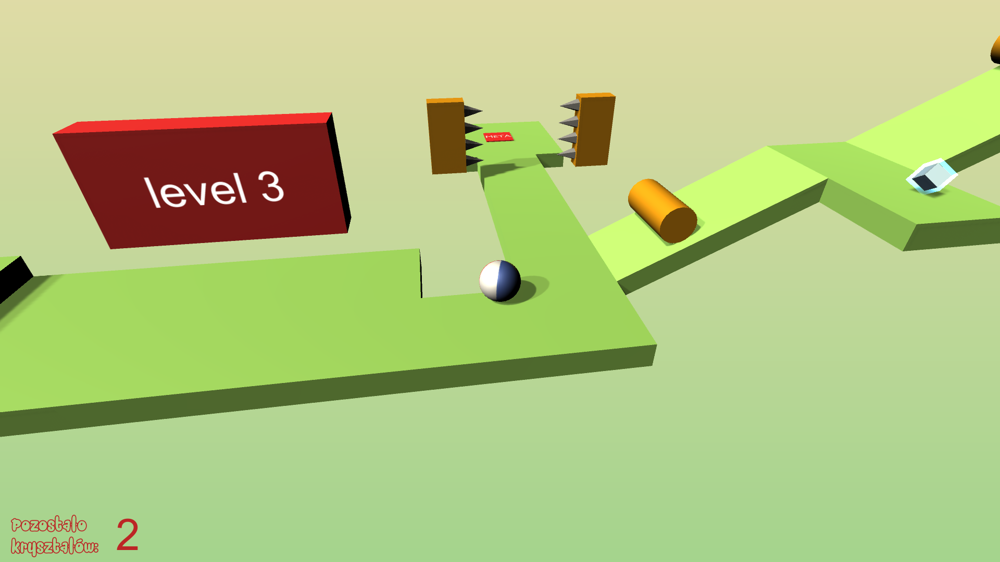
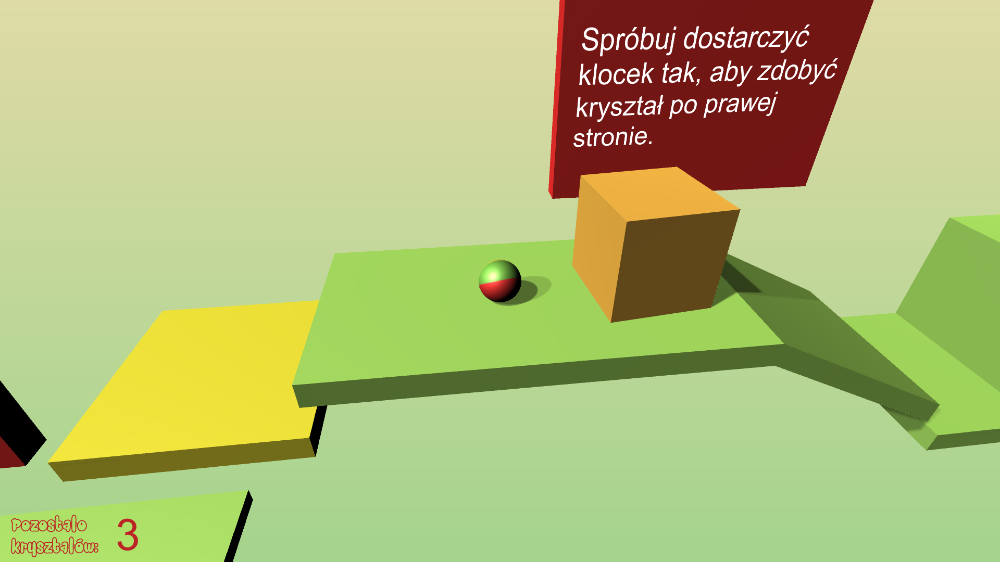
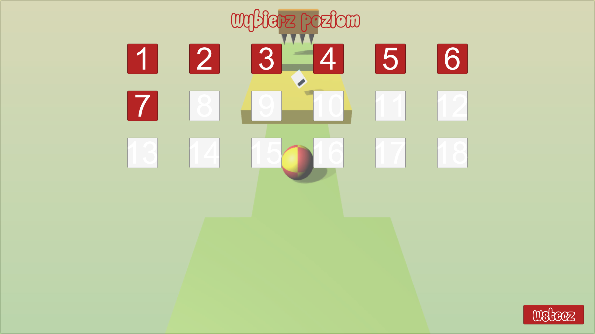
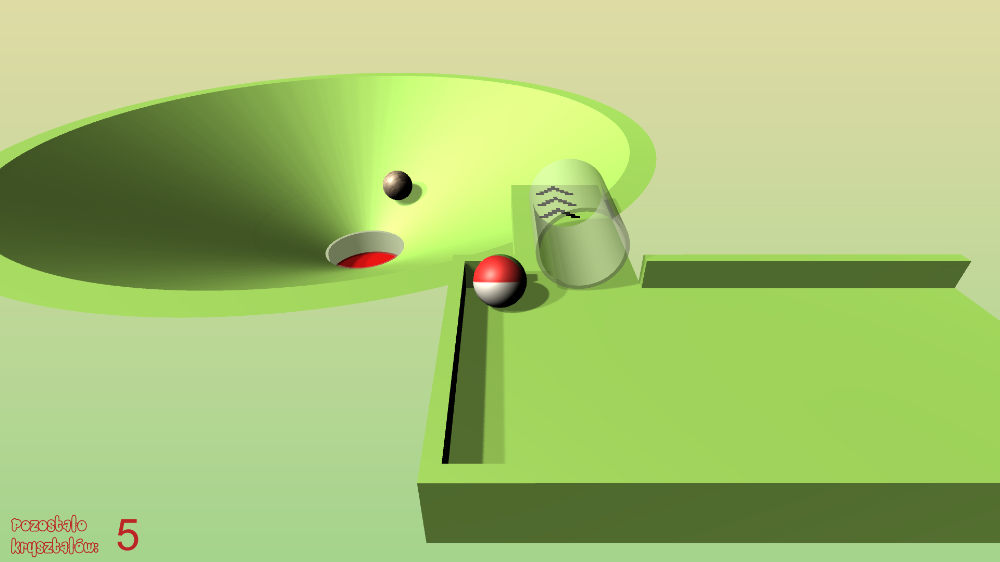

# Ball's Evolution
> A 3D video game using the Unity engine, in which player controls the Ball through the 18 levels, collecting crystals and passing through the obstacles.

## Table of contents
* [General info](#general-info)
* [Screenshots](#screenshots)
* [Technologies](#technologies)
* [Setup](#setup)
* [Features](#features)
* [Status](#status)
* [Inspiration](#inspiration)
* [Contact](#contact)

## General info
Player's goal is to collect all of the crystal on each level and reach the finish line. In the game you can find many obstacles such as: moving platforms, spikes or even guard turrets shooting to you.

## Screenshots

## Technologies
* Unity
* Blender

## Setup
Go to 'Built' folder and download the all files. To run the game press Ball's Evolution.exe.

## Features
List of features:
* moving the ball and jumping
* unlocking new skins for ball along with progress in game

To do:
* add more levels
* conversion to mobile devices

## Status
Project is: finished

## Inspiration
The game was inspired by course "Kurs tworzenia gier w Unity 3D" created by Mobilestage.in channel on YouTube.

## Contact
Created by Rafał Giemza

